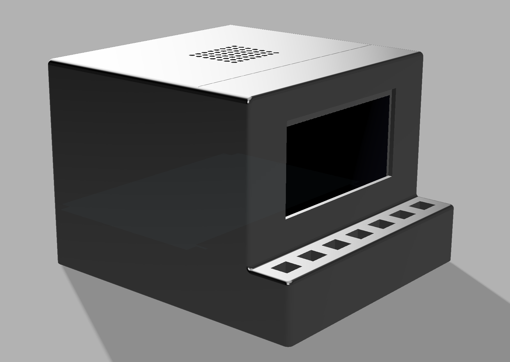
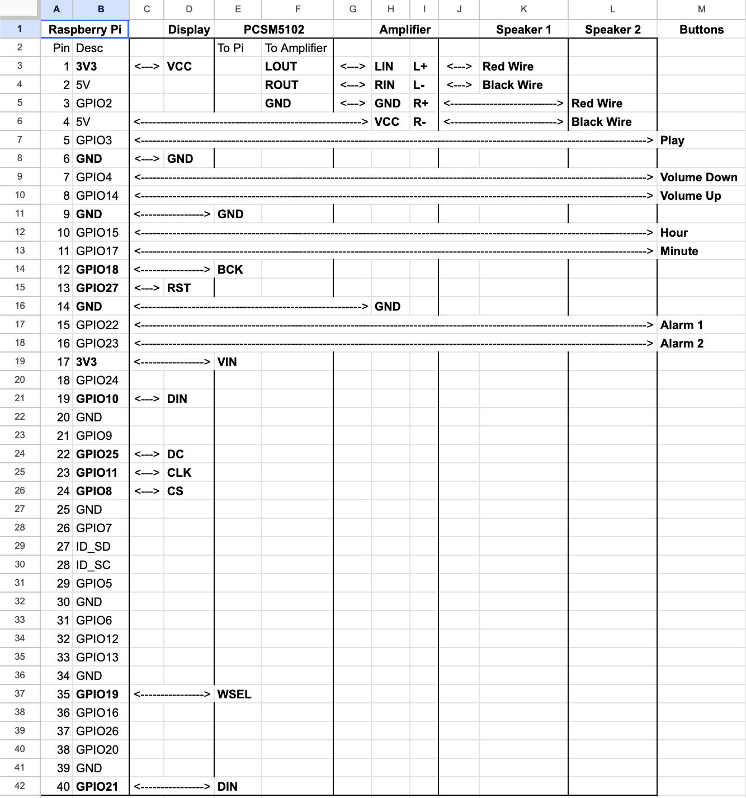

# Alarm Clock
## What is it?
My project is a simple alarm clock using a 128x64 OLED display. It has 7 buttons and you shall be able to set 2 different alarms. It is NOT anything to do with pihole, I'm unsure why I called the repo that I think I got confused. It is made entirely in Python.

## Why I made it?
I made this project since I don't particularly like my own alarm clock since it can only set a single alarm. This one will be able to set 2 and maybe in a new version I could add even more.

## How to use it?
1. Install Raspberry Pi OS Lite on the Pi.
2. Clone the repo.
3. Put together all the pieces.
4. Run the code over ssh from a computer (this won't always be like this, just for debugging).
5. The time is updated automatically over wifi so you don't need to set that.
6. Set alarms by holding the corresponding alarm button and then pressing the hour and minute buttons to change it.
7. Enable and disable alarms by pressing the corresponding alarm button.

## How to build it?
1. 3D print the 2 bits of the case
2. Sit the buttons in the slots
3. Use a soldering iron to solder wires directly to the pins at the bottom of the buttons, accessible from the botton, and thread those wires into the back.
4. Plug the cable into the screen and place it into the screen holder, it should stay there, but if not bluetack or hot glue could be used to glue it in place if necessary.
5. Take the top case part and place the speaker where it will be mounted, mark with a pencil to show where the drill holes will go in the ceiling of the case.
6. Drill a small hole into those holes.
7. Solder the DAC, amplifer, and speaker as shown in the wiring diagram.
8. Connect the DAC and amplifier to the Pi as shown in the wiring diagram.
9. Connect the button wires to the pins on the Pi.
10. Use long screws to attach the speaker to the roof.
11. Hang the DAC and amplifer on the walls.
12. Plug the screen into the Pi and put the Pi on the interior of the back (ontop of the pins), while also placing the top part of the case on the bottom.
13. The 2 case parts will fit together nicely probably.
14. The Pi can be connected to a computer via the slot.
15. Functionality for running at boot is not yet implemented so it will have to be sshed into on another device and started. This functionality will be added when I get the parts.

## Images

*Side view of the alarm clock.*

*Wiring diagram made in google sheets*

## Bill of Materials
[Link](BoM.csv)
